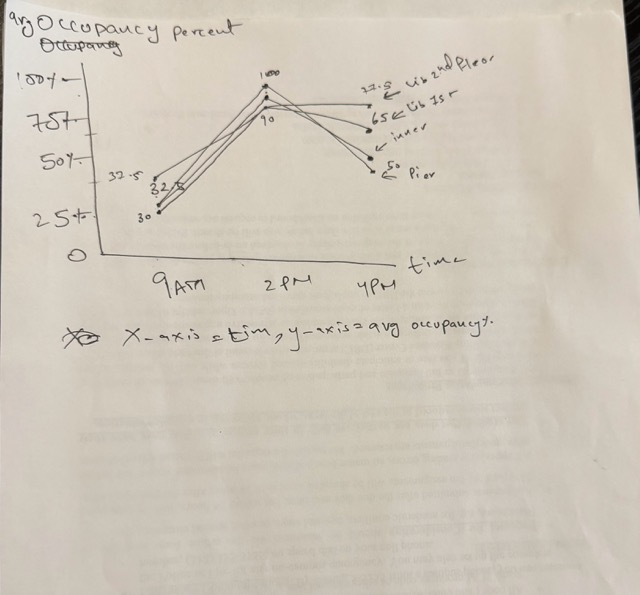
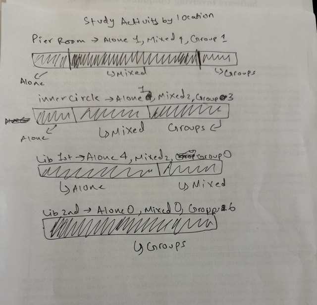
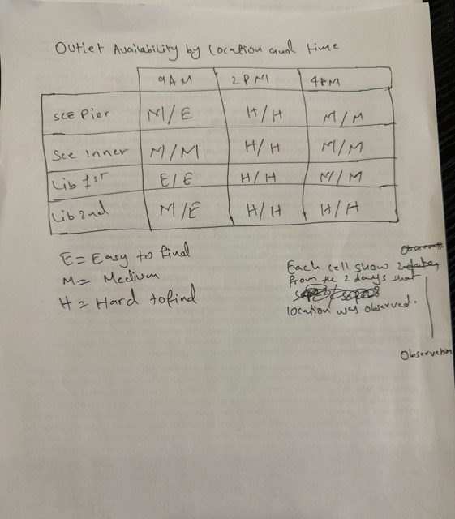

# cs424-HW1
Collecting data and sketching visualizations

## Task 1

For this project, I want to look at different study spaces around UIC. As I use these places a lot, and I noticed that some can be really crowded and busy at certain times while others are not. Other than that some places are also quieter, better for group work, or have more seats and outlets available. I want to compare a few study spaces and see how they change depending on the time.

### Domain Questions

1. Which study spaces are usually the most crowded?
2. How does the noise level change at different places and times?
3. Which study spaces are used more for group work and which are used more for studying alone?
4. At what times and in which study spaces are seats and outlets harder to find?

### Data Collection Plan
So if we talk about Data Collection Plan It is:
One observation will be one study space at a certain time.

So i will look at around 3 or 4 study spaces around UIC at different times. Each time, I will record the location, time, how many seats are being used, how many seats there are total, the noise level, whether people are mostly alone or in groups, and how easy it is to find an outlet.

So looking at different places and different times will help me compare the study spaces instead of only looking at one place.

As I am doing this project by myself, I will collect all of the data. I will try to use the same categories each time so the observations stay consistent.

One limitation is that things like noise level and whether people are studying alone or in groups are based on what I see, so they might not always be exact. Also, the number of people in a study space can change pretty quickly.

### Initial Data Dictionary

| Attribute | Type | Description | Example |
|---|---|---|---|
| `location` | Categorical | Study space being observed | Library |
| `time` | Temporal | Time I looked at the space | 6:00 PM |
| `filled_seats` | Quantitative | About how many seats are being used | 50 |
| `total_seats` | Quantitative | About how many seats are in the area | 55 |
| `noise_level` | Ordered | How noisy the space is | Quiet / Medium / Loud |
| `study_activity` | Categorical | Whether people are mostly alone, in groups, or mixed | Mostly alone |
| `free_outlet` | Ordered | How easy it is to find an free outlet | Easy / Medium / Hard |

## Task 2:

So I collected 12 observations from the four study spaces. While collecting the data, I noticed that counting the exact number of occupied seats and total seats was harder than I expected, especially when the spaces were busy.

So because of this, I changed to `occupancy_percentage`. As instead of counting every seat, I estimated how full the space was as a percentage. This was much easier to record and still showed how crowded each study space was.

Other than that, the other attributes like for example noise level, study activity, and outlet availability worked fine, so I kept them the same.

For the final data collection, I observed the four study spaces on multiple days at around 9 AM, 2 PM, and 4 PM. I ended up with 24 total observations. The full dataset is included in the csv file.

### Final Data Dictionary

| Attribute | Type | Description | Example |
|---|---|---|---|
| `date` | Temporal | Date of the observation | 2026-09-22 |
| `location` | Categorical | Study space being observed | SCE - Pier Room |
| `time` | Temporal | Time of the observation | 2:00 PM |
| `occupancy_percentage` | Quantitative | Percentage of the study space that was occupied | 90% |
| `noise_level` | Ordered | How noisy the study space was | Quiet / Medium / Loud |
| `study_activity` | Categorical | Whether people were mostly alone, in groups, or mixed | Mixed |
| `outlet_availability` | Ordered | How easy it was to find an available outlet | Easy / Medium / Hard |

## Task 3:

My final dataset has 24 data observations, which represent four study spaces at UIC: SCE Pier Room, SCE Inner Circle, Library 1st Floor, and Library 2nd Floor. These were observed at around 9 AM, 2 PM, and 4 PM on different days and weeks. So I collected all of the data by visiting each area myself in person at the times listed and recorded what I saw and observed. In this dataset, I kept the information about the location, the time of observation, percentage of occupied seats, noise level, study activity, and outlet availability.

The data shows how the study spaces change depending on the place and time of day. One limitation is that I only observed each place on a few days, so it might not show what the spaces are like every day. Some of the data was also based on my own judgment. For example, the occupancy percentage was estimated, and sometimes noise level or outlet availability for example could be between two values.

When turning my observations into data, I also lost some details. For example I did not count every person or seat exactly, and did not record things like how long people stayed or why they picked a certain study space. So i mainly focused on the things that were easier to observe and compare.

### Domain Questions

1. **Which study spaces are the most crowded, and how does that change during the day?**  
   So i wanted to look at this because it can help students and me know which places might be easier to find a seat in at different times. So I can use `location`, `time`, and `occupancy_percentage` to compare how busy each place gets.

2. **Are more crowded study spaces usually louder?**  
   I thought this would be useful because some students may prefer quieter places when they are studying. Also i can compare `occupancy_percentage` and `noise_level` to see if more crowded places are usually louder.

3. **Which places are used more for group study and which are used more for studying alone?**  
   So i wanted to see if some spaces are used more for group work while others are better for people studying alone. I can use `location` and `study_activity` to compare how each place is normally used.

4. **When and where are outlets harder to find?**  
   I wanted to look at this because students may need outlets to charge their laptops or phones while studying. So i can compare `outlet_availability`, `location`, `time`, and `occupancy_percentage` to see where and when outlets are harder to find.
   
These questions are pretty similar to my original questions, but I changed them a little based on the data I actually collected. Since i changed from exact seat counts to occupancy percentage, i mostly focused more on how crowded the spaces were instead of the exact number of available seats.

## Task 4:

So for this task, I changed the four questions from Task 3 into more like general tasks. The main idea is to explain what someone is trying to do with the data instead of deciding what graph to use.

### 1. Which study spaces are the most crowded, and how does that change during the day?

**Action:** Compare  
**Target:** Occupancy across different locations and times

So the goal is to compare how crowded each study space is and how that changes at different times of the day.

### 2. Are more crowded study spaces usually louder?

**Action:** Compare  
**Target:** Occupancy percentage and noise level

Again the goal is to compare crowding and noise to see if more crowded places are usually louder.

### 3. Which places are used more for group study and which are used more for studying alone?

**Action:** Compare and summarize  
**Target:** Study activity across different locations

The goal is to compare the study activity in each place and see which spaces are used more by groups, people studying alone, or a mix of both.

### 4. When and where are outlets harder to find?

**Action:** Identify and compare  
**Target:** Outlet availability across locations, times, and occupancy levels

So the main goal is to find which places and times have harder outlet availability and compare that with how crowded the space is.

So doing these task abstractions helped me think more about what someone actually needs to find from the data. Instead of thinking about a certain graph right away, like for example i can first maybe think about what needs to be compared, identified, or summarized and so on.

## Task 5:

### Initial Sketch 1: Average Occupancy Over Time

So for my first sketch i used a line graph to show how the average occupancy changes at different times of the day. This connects to my question about which study spaces are more crowded and when they get busy. As you can see I used time, location, and occupancy_percentage. The x-axis shows the time and the y-axis shows the average occupancy percentage. Additionally, each line shows a different study area. Also i think this works well because it makes it easy to see that the study spaces get much more crowded and busy around 2 PM. Other than that, one problem is that some of the lines are really close together, so they can be a little hard to tell apart.

### Initial Sketch 2: Study Activity by Location

For my second sketch, I compare how people were studying in each location. So this connects to my question about which places are used more for group study and which are used more for studying alone. For this i used location and study_activity. As we can see each bar represents one study space, and each part of the bar shows Mostly Alone, Mixed, or Mostly Groups. I think this works well because it is easy to compare the study activity between the different places. One weakness i found is that it does not show what time of day the activity took place.

### Initial Sketch 3: Outlet Availability by Location and Time

Lastly for my third sketch, I tried to show outlet availability at each study area and time. So this connects to my question about when and where outlets are harder to find. The attributes i used include location, time, and outlet_availability. The rows show the different study spaces and the columns show the times. I used E for Easy, M for Medium, and H for Hard to make it easy to understand. Also i think this works well because it is easy to compare outlet availability between different places and times. One weakness is that it does not show how crowded the place was at the same time.

So these three sketches are different from each other as we can see because one focuses on change over time, one compares study activity, and one compares outlet availability.
